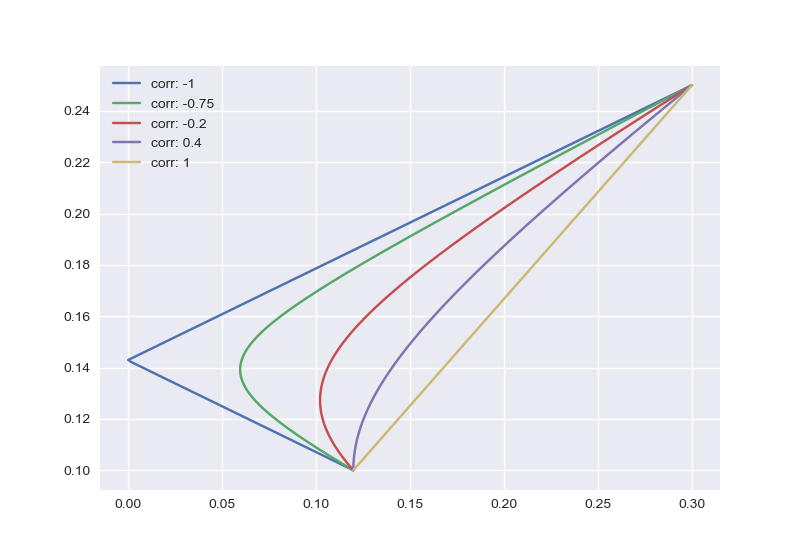

# Finance Instruments
Básica librería de instrumentos financieros, usado para resolver ejercicios.

## Prerrequisitos
El código está en Python 3 y se necesitan de las siguiente librerías.

- numpy
- matplotlib

## Instalación
Para poder usar el código es necesario que ubique el archivo **pynance.py** en el mismo folder de su proyecto y de allí importarlo, de igual manera para correr el archivo **test.py**.

## Explicación
El motivo de este proyecto es el de resolver ejercicios básicos de bonos y portafolios (en desarrollo).

### Bonos
En los bonos lo que se ha desarrollado es la obtención del **precio del bono** conociendo su Valor Nominal, tasa de interés, tasa cupón y tiempo del ejercicio. El precio se obtiene con la siguiente fórmula:


La duración del bono (duración de macaulay), se obtiene de la siguiente fórmula:


La duración modificada resulta de la duración de macaulay:


La convexidad se obtiene de la siguiente fórmula:


Los anterios valores se han calculado con el fin de obtener la variación del precio del bono ante cambios en la tasa de interés. Para eso se realizan tres métodos:

- El método simple que es obteniendo el precio del bono según la tasa de interés.
- El segundo método es usando solo la duración modificada.
- Por último, el método a usar es usando la convexidad.

## Explicación test.py
El archivo **test.py** solo hace uso de la clase Portfolio.

```python
def main():
    """Realizar los test"""
    #Características del instrumento A.
    r_a = 0.1
    sd_a = 0.12

    #Características del instrumeno B
    r_b = 0.25
    sd_b = 0.3

    #Peso del instrumento A en el portafolio
    weights = 0.1
    corr = -1

    stock_a = fy.Asset(r_a, sd_a)
    stock_b = fy.Asset(r_b, sd_b)

    portfolio = fy.Portfolio(stock_a, stock_b, weights, corr)
    figure = portfolio.show_yields([-1, -0.75, -0.2, 0.4, 1])
    figure.savefig("images/yields.png")
    print(portfolio.description())
```

En las primeras líneas se crean los instrumentos financieros, en este caso Acciones, después se usan para crear el portafolio. En el test se grafica las curvas de rendimiento del portafolio según la correlación entre las correlaciones.


Por útlimo se muestra la descripción del portafolio:

Covarianza         : -0.036
Rendimiento        :  0.235
Varianza           : 0.0666
Desviación estándar:  0.258

## Autor
**Enzo Enrique Falcón Astuhuayhua**
