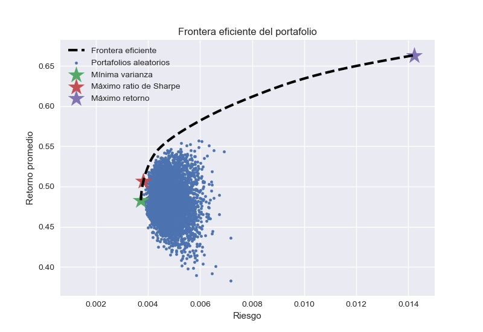

# Finance Instruments
Básica librería de instrumentos financieros, usado para resolver ejercicios.

## Prerrequisitos
El código está en Python 3 y se necesitan de las siguiente librerías.

- numpy
- matplotlib
- sciypy

## Instalación
Para poder usar el código es necesario que ubique el archivo **pynance.py** en el mismo folder de su proyecto y de allí importarlo, de igual manera para ver un simple uso de la librería (graficar la frontera eficiente del protafolio) el archivo **test.py** hará muestra de ello.

## Explicación
El motivo de este proyecto el de mostrar la frontera eficiente de un portafolio.

## Explicación test.py
El archivo **test.py** solo hace uso de la clase Portfolio, el cual mostrará la frontera eficiente del protafolio que ha sido generado por variables aleatorias (es un caso de ejemplo).

Como se observarán en las primeras líneas de archivo **test.py**, se generan las variables aleatorias con la librería numpy, además, cabe destacar que los valores que se ingresan a la clase Portfolio deben ser los retornos diarios de las acciones.

## Autor
**Enzo Enrique Falcón Astuhuayhua**
